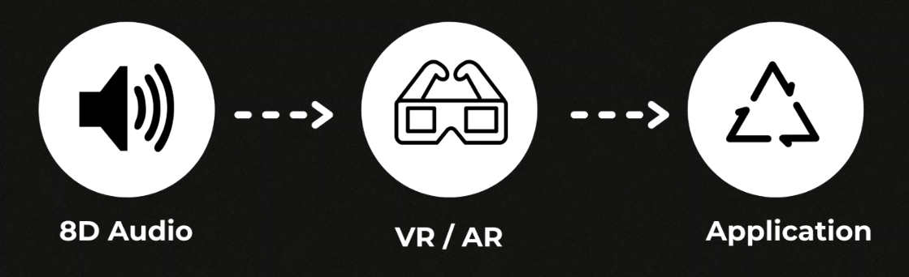
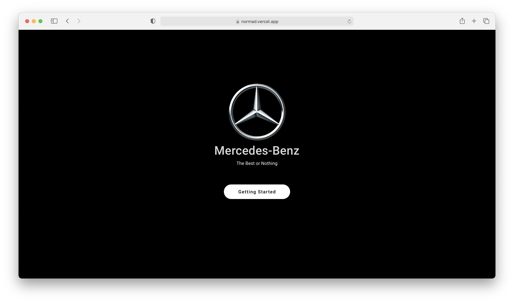
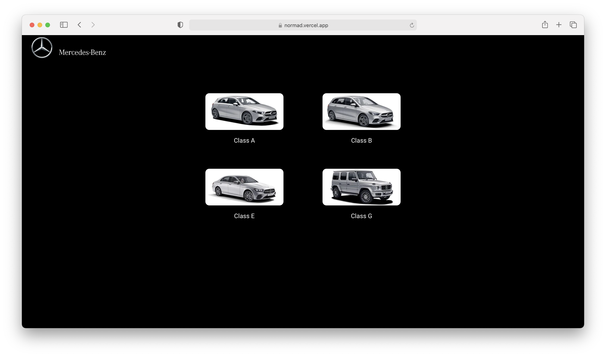
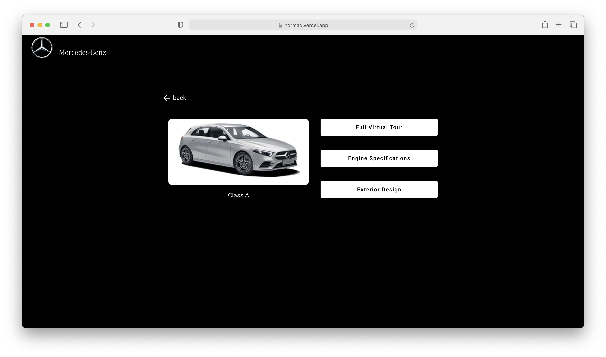

  <!-- Dependency Status -->
<h1 align="center">
  
</h1>

  

  

  <a href="#key-features">Key Features</a> •
  <!-- <a href="#howto">How To Use</a> • -->
  <a href="#contributors">Contributors</a>

A fully immersive customer experience using connceted device technology for sound and AR that is integrated to mercedes iPad touchpoint systems.

<h1 align="center">
  
</h1>

## Key Features

* Area targeted Augumented Reality
* Fog computing for decentralized computing infrastructure
* 8D audio using spacial reverb and mixing. Check out **[here](https://www.youtube.com/watch?v=pgeFdOayeaw&ab_channel=Saigy)** for experience.

## Technologies and Third party libraries

A few things to note in the project:
* **[BinauralSpatializer]()** - This contains the declaration and definition files which are used for binaural spatialization. The library includes a real-time 3D binaural audio renderer offering full 3D spatialization. 
* **[Vue JS]()** - model–view–viewmodel front end JavaScript framework for building user interfaces.
* docker-compose - Docker compose script to start service in production mode.
* **[AR.js]()** - AR.js is a lightweight library for Augmented Reality on the Web, coming with features like Image Tracking, Location based AR and Marker tracking.
* **[Vuforia Engine](#)** - software development kit (SDK) for creating Augmented Reality apps.

## Customer App

  
  
  

## Staff App

  
  
  
  
  
  

## Contributors

<table>
  <tr>
    <td align="center"><a href="https://kentcdodds.com"> <b>Abhinav Gupta</b></a> 🔍 🚇 🔊</td>
    <td align="center"><a href="https://github.com/jfmengels"> <b>Laura Chavez</b></a> 📋 📢</td>
    <td align="center"><a href="https://github.com/jfmengels"> <b>Umang Raval</b></a> 💻 📦 📖</td>
    <td align="center"><a href="https://github.com/jfmengels"> <b>Valeria Dolce</b></a> 🎨 💻</td>
    </tr>
</table>
